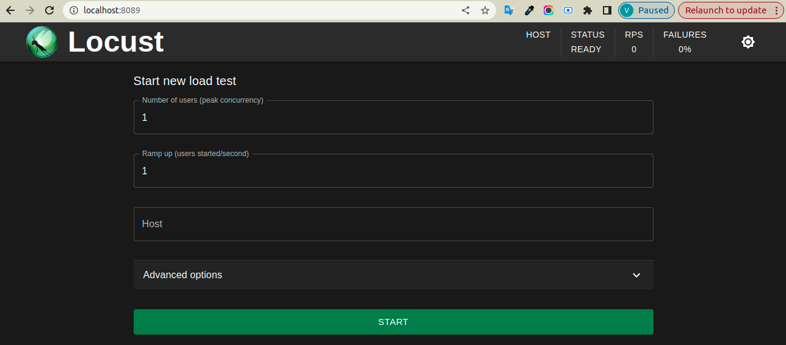
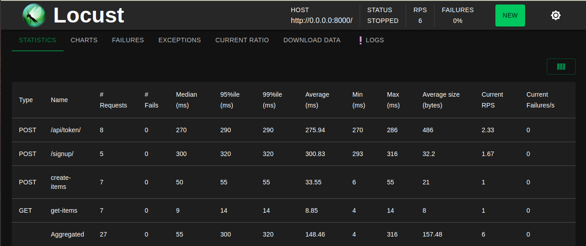
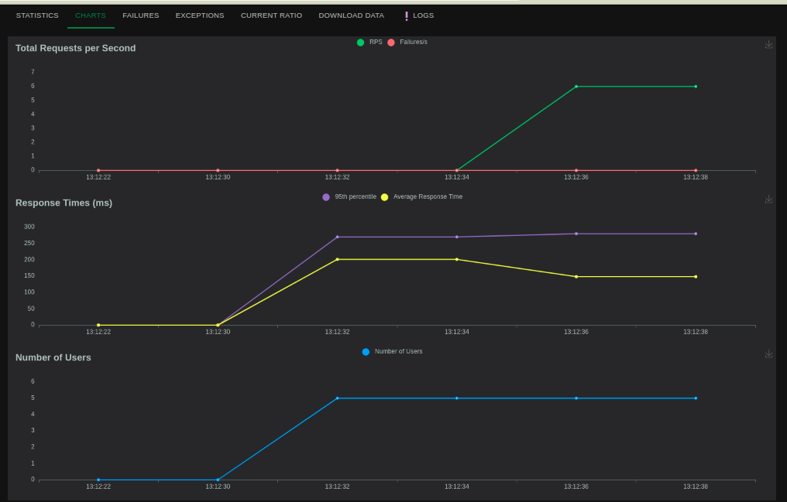

# LocustLoadTesting
How to do API load testing using locust tool in python.

Create a virtual environment to install dependencies in and activate it:

```sh
$ virtualenv -p python3 env
$ source env/bin/activate
```
Note the `(env)` in front of the prompt. This indicates that this terminal
session operates in a virtual environment set up by `virtualenv2`.

Then install the dependencies:
```sh
(env)$ pip install -r requirements.txt
```

Once `pip` has finished downloading the dependencies:
```sh
(env)$ cd project
(env)$ python manage.py runserver
```

## Locust
Once server is running 
cd to locustfile.py
```sh
(env)$ cd project
(env)$ locust -f locustfile.py
```

# Locust server default port 8089


Set All the neccessary details like Host, Peak users and Users/sec
Then select time in advance option


## After starting load testing here you can checkout statistics and charts.




